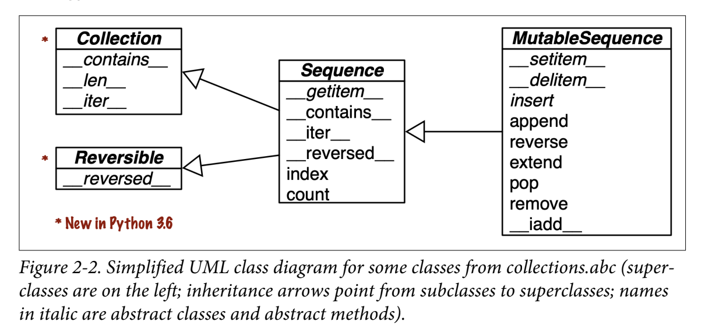

# Chapter 02 An array of sequences

* This chapter will cover:
  * List comprehensions and the basics of generator expressions
  * Using tuples as records versus using tuples as immutable lists
  * Sequence unpacking and sequence patterns
  * Reading from slices and writing to slices
  * Specialized sequence types, like arrays and queues

## Overview of built-in sequence

* Container sequences: e.g.`list`, `tuple`, `collections.deque` holds different types.
    * holds references to the objects it contains.
* Flat sequences: e.g. `str`, `bytes`, `bytearray`, `memoryview`, `array.array` holds one type.
    * stores the value of its contents in its own memory space.
    * More compact, but are limited to holding primitive machine values like `bytes`, `integers`, and `floats`.
* Every Python object in memory has a header with metadata.
* The simplest one, `float`, has a value field and two metadata fields:
    * `ob_refcnt`: the object’s reference count, 8-byte in 64-bit python build.
    * `ob_type`: a pointer to the object’s type, 8-byte in 64-bit python build.
    * `ob_fval`: a C double holding the value of the `float`, 8-byte in 64-bit python build.
* So, an array of `floats` is much more compact than a tuple of `floats`.
* From mutable point of view:
    * mutable: `list`, `collections.deque`, `bytearray`, `memoryview`, `array.array`
    * immutable: `tuple`, `str`, `bytes`
* UML diagram:
    * `class Sequence(Container, Iterable, Sized)`
    * `class MutableSequence(Sequence)`



```python
"""

    >>> from collections import abc
    >>> issubclass(tuple, abc.Sequence)
    True
    >>> issubclass(list, abc.MutableSequence)
    True

"""
```

* Keep in mind these common traits: mutable versus immutable; container versus flat. They are helpful to extrapolate what you know about one sequence type to others.

## List Comprehension (list comps) and generator expressions (genexps)

* A quick way to build a sequence is using a list comprehension (if the target is a list) or a generator expression (for other kinds of sequences).

  * faster and more readable.
  * If you are not doing something with the produced list, you should not use that syntax.
  * Also, try to keep it short. If the list comprehension spans more than two lines, it is probably best to break it apart or rewrite it as a plain old for loop.

  ```python
  """
  # listcomp.py
  >>> symbols = '$¢£¥€¤'
  >>> codes = [ord(code) for code in symbols]
  >>> codes
  [36, 162, 163, 165, 8364, 164]
  """
  ```

* In Python code, line breaks are ignored inside pairs of `[]`, {}, or `()`. So you can build multiline lists, listcomps, tuples, dictionaries, etc., without using the `\` line continuation escape, which doesn’t work if you accidentally type a space after it.

* Also, when those delimiter pairs are used to define a literal with a comma-separated series of items, a trailing comma will be ignored. So, for example, when coding a multiline list literal, it is thoughtful to put a comma after the last item, making it a little easier for the next coder to add one more item to that list, and reducing noise when reading diffs.

### Local Scope Within Comprehensions and Generator Expressions

* Variables assigned with the “Walrus operator” := remain accessible after those comprehensions or expressions return—unlike local variables in a function. PEP 572—Assignment Expressions defines the scope of the target of := as the enclosing function, unless there is a global or nonlocal declaration for that target.

```python
"""
>>> x = 'ABC'
>>> codes = [ord(x) for x in x]
>>> x # x was not clobbered: it’s still bound to 'ABC'.
'ABC'
>>> codes
[65, 66, 67]
>>> codes = [last := ord(c) for c in x]
>>> last # last remains.
67
>>> c # doctest: +IGNORE_EXCEPTION_DETAIL
Traceback (most recent call last):
NameError: name 'c' is not defined

In the above example c is gone; it existed only inside the listcomp.

"""
```

## Listcomps Versus map and filter

* `map` and `filter` lost some readablity. Luciano used to think listcomp is much slower than `map` and `filter`, but this is not the case. See the results below.
  * To see the difference between `number` and `repeat`, see [here](https://stackoverflow.com/questions/56763416/what-is-diffrence-between-number-and-repeat-in-python-timeit).


```python
# listcomps_speed.py
import timeit

TIMES = 10000
SETUP = """
symbols = '$¢£¥€¤'
def non_ascii(c):
    return c > 127
"""


def clock(label, cmd):
    res = timeit.repeat(cmd, setup=SETUP, number=TIMES, repeat=6)
    print(label, *(f'{x:.3f}' for x in res))


clock('listcomp        :', '[ord(s) for s in symbols if ord(s) > 127]')
clock('listcomp + func :', '[ord(s) for s in symbols if non_ascii(ord(s))]')
clock('filter + lambda :', 'list(filter(lambda c: c > 127, map(ord, symbols)))')
clock('filter + func   :', 'list(filter(non_ascii, map(ord, symbols)))')

listcomp        : 0.007 0.007 0.006 0.007 0.007 0.007
listcomp + func : 0.011 0.010 0.011 0.010 0.011 0.011
filter + lambda : 0.009 0.009 0.009 0.009 0.009 0.009
filter + func   : 0.009 0.008 0.008 0.008 0.009 0.011
```

## Cartesian Products

* Listcomps can build lists from the Cartesian product of two or more iterables. The items that make up the Cartesian product are tuples made from items from every input iterable.
* code: `cartesian.py`

```python
>>> colors = ['black', 'white']
>>> sizes = ['S', 'M', 'L']

>>> tshirts = [(color, size) for color in colors
...                          for size in sizes ]
>>> tshirts   # doctest: +NORMALIZE_WHITESPACE
[('black', 'S'), ('black', 'M'), ('black', 'L'), ('white', 'S'),
('white', 'M'), ('white', 'L')]

>>> tshirts = [(color, size) for size in sizes
...                          for color in colors ]
>>> tshirts  # doctest: +NORMALIZE_WHITESPACE
[('black', 'S'), ('white', 'S'), ('black', 'M'), ('white', 'M'),
('black', 'L'), ('white', 'L')]
```

* listcomp builds list, genexp builds other sequences.

## Generator Expressions

* `genexp` saves memory because it yields items one by one using the iterator protocol instead of building a whole list.
  * ① If the generator expression is the single argument in a function call, there is no need to duplicate the enclosing parentheses.
  * ② The `array` constructor takes two arguments, so the parentheses around the generator expression are mandatory.


```python
>>> symbols = '$¢£¥€¤'
>>> tuple(ord(code) for code in symbols)  # ➊
(36, 162, 163, 165, 8364, 164)

>>> import array
>>> array.array('I', (ord(code) for code in symbols))  # ➋
array('I', [36, 162, 163, 165, 8364, 164])
```

* The next example:
  * Here the six-item list of T- shirts is never built in memory: the generator expression feeds the `for` loop producing one item at a time.

```python
>>> for tshirt in ('%s %s' % (color, size) for color in colors for size in sizes):
...     print(tshirt)
black S
black M
black L
white S
white M
white L
```

## Tuples are not just immutable lists

* Tuples do double duty:
  * they can be used as immutable lists
  * also as records with no field names.

### Tuples as Records

* Tuples hold records: each item in the tuple holds the data for one field, and the position of the item gives its meaning.
    1. The `%` formatting operator understands tuples and treats each item as a separate field.
    2. The `for` loop knows how to retrieve the items of a tuple separately—this is called “unpacking.” Here we are not interested in the second item, so we assign it to `_`, a dummy variable.

```python
>>> lax_coordinates = (33.9425, -118.408056)
>>> city, year, pop, chg, area = ('Tokyo', 2003, 32450, 0.66, 8014)
>>> traveler_ids = [('USA', '31195855'), ('BRA', 'CE342567'),
... ('ESP', 'XDA205856')]

>>> for passport in sorted(traveler_ids):
...    print('%s/%s' % passport)  // 1
...
BRA/CE342567
ESP/XDA205856
USA/31195855

>>> for country, _ in traveler_ids:  // 2
...     print(country)
...
USA
BRA
ESP
```

* We have two examples of tuple unpacking here:
  * we assigned `('Tokyo', 2003, 32_450, 0.66, 8014)` to `city, year, pop, chg, area` in a single statement.
  * the `%` operator assigned each item in the passport tuple to the corresponding slot in the format string in the `print` argument.

### Tuples as Immutable Lists

* *Clarity*: When you see a tuple in code, you know its length will never change.
* *Performance*: A tuple uses less memory than a list of the same length, and it allows Python to do some optimizations.
* References in a `tuple` cannot be deleted or replaced. But if one of those references points to a mutable object, and that object is changed, then the value of the `tuple` changes.

```python
>>> a = (10, 'alpha', [1, 2])
>>> b = (10, 'alpha', [1, 2])
>>> a == b
True
>>> b[-1].append(99)
>>> a == b
False
>>> b
(10, 'alpha', [1, 2, 99])
```

* An object is only hashable if its value cannot ever change. An unhashable tuple cannot be inserted as a `dict` key, or a `set` element.
* If you want to determine explicitly if a tuple (or any object) has a fixed value, you can use the `hash` built-in to create a fixed function like this:

```python
def fixed(o):
    """
    >>> tf = (10, 'alpha', (1, 2))
    >>> fixed(tf)
    True
    >>> tf = (10, 'alpha', [1, 2])
    >>> fixed(tf)
    False
    """
    try:
        hash(o)
    except TypeError:
        return False
    return True
```

* Raymond Hettinger on the efficiency of `tuple` over `list`
  * To evaluate a tuple literal, the Python compiler generates bytecode for a tuple constant in one operation; but for a list literal, the generated bytecode pushes each element as a separate constant to the data stack, and then builds the list.
  * Given a tuple `t`, `tuple(t)` simply returns a reference to the same `t`. There’s no need to copy. In contrast, given a list `l`, the `list(l)` constructor must create a new copy of `l`.
  * Because of its fixed length, a `tuple` instance is allocated the exact memory space it needs. Instances of `list`, on the other hand, are allocated with room to spare, to amortize the cost of future appends.
  * The references to the items in a tuple are stored in an array in the tuple struct, while a list holds a pointer to an array of references stored elsewhere.

### Comparing Tuple and List Methods

* `tuple` supports all list methods that do not involve adding or removing items, with one exception—`tuple` lacks the `__reversed__` method.
* However, that is just for optimization; `reversed(my_tuple)` works without it.

## Unpacking Sequences and Iterables

* Unpacking is important because it avoids unnecessary and error-prone use of indexes to extract elements from sequences.
* Also, unpacking works with any iterable object as the data source—including iterators, which don’t support index notation (`[]`).
  * The only requirement is that the iterable yields exactly one item per variable in the receiving end, unless you use a star (`*`) to capture excess items,

* tuple unpacking (`tupleunpacking.py`):
    * The most visible form of unpacking is parallel assignment
    
    ```python
    >>> lax_coordinates = (33.9425, -118.408056)
    >>> latitude, longitude = lax_coordinates
    >>> latitude
    33.9425
    >>> longitude
    -118.408056
    ```
    
    * Can do swapping value elegently, i.e. `a, b = b, a`
    * Prefix an argument with a star when calling a function.
    
    ```python
    >>> divmod(20, 8)
    (2, 4)
    >>> t = (20, 8)
    >>> divmod(*t)
    (2, 4)
    >>> quotient, remainder = divmod(*t)
    >>> quotient
    2
    >>> remainder
    4
    ```
    
    * When don't care a variable, use `_`
    
    ```python
    >>> import os
    >>> _, filename = os.path.split('/home/luciano/.ssh/id_rsa.pub')
    >>> filename
    'id_rsa.pub'
    ```

### Using `*` to Grab Excess Items

* Defining function parameters with *args to grab arbitrary excess arguments is a classic Python feature.
* In Python 3, this idea was extended to apply to parallel assignment as well:

```python
>>> a, b, *rest = range(5)
>>> a, b, rest
(0, 1, [2, 3, 4])
>>> a, b, *rest = range(3)
>>> a, b, rest
(0, 1, [2])
>>> a, b, *rest = range(2)
>>> a, b, rest
(0, 1, [])
```

* In the context of parallel assignment, the `*` prefix can be applied to exactly one variable, but it can appear in any position:

```python
>>> a, *body, c, b = range(5)
>>> a, body, c, b
(0, [1, 2], 3, 4)
>>> *head, b, c, d = range(5)
>>> head, b, c, d
([0, 1], 2, 3, 4)
```

### Unpacking with `*` in Function Calls and Sequence Literals

* In function calls, we can use `*` multiple times:

```python
>>> def func(a, b, c, d, *rest):
...     return a, b, c, d, rest
>>> func(*[1, 2], 3, *range(4, 7))
(1, 2, 3, 4, (5, 6))
```

* The `*` can also be used when defining `list`, `tuple`, or `set` literals, as shown in these examples from “What’s New In Python 3.5”:

```python
>>> *range(4), 4
(0, 1, 2, 3, 4)
>>> [*range(4), 4]
[0, 1, 2, 3, 4]
>>> {*range(4), 4, *(5, 6, 7)}
{0, 1, 2, 3, 4, 5, 6, 7}
```

### Nested Unpacking

* The target of an unpacking can use nesting, e.g., `(a, b, (c, d))`.
  * Each tuple holds a record with four fields, the last of which is a coordinate pair.
  * By assigning the last field to a nested tuple, we unpack the coordinates.
  * The `lon <= 0`: test selects only cities in the Western hemisphere.

```python
>>> metro_areas = [
...     ('Tokyo','JP',36.933,(35.689722,139.691667)), # 1
...     ('Delhi NCR', 'IN', 21.935, (28.613889, 77.208889)),
...     ('Mexico City', 'MX', 20.142, (19.433333, -99.133333)),
...     ('New York-Newark', 'US', 20.104, (40.808611, -74.020386)),
...     ('São Paulo', 'BR', 19.649, (-23.547778, -46.635833)),
... ]
>>> def main():
...     print(f'{"":15} | {"latitude":>9} | {"longitude":>9}')
...     for name, _, _, (lat, lon) in metro_areas: # 2
...         if lon <= 0: # 3
...             print(f'{name:15} | {lat:9.4f} | {lon:9.4f}')
>>> main()
                |  latitude | longitude
Mexico City     |   19.4333 |  -99.1333
New York-Newark |   40.8086 |  -74.0204
São Paulo       |  -23.5478 |  -46.6358
```

* The target of an unpacking assignment can also be a list, but good use cases are rare. Here is the only one I know: if you have a database query that returns a single record (e.g., the SQL code has a `LIMIT 1` clause), then you can unpack and at the same time make sure there’s only one result with this code:

```python
[record] = query_returning_single_row()
```

* If the record has only one field, you can get it directly, like this:

```python
[[field]] = query_returning_single_row_with_single_field()
```

* Both of these could be written with tuples, but don’t forget the syntax quirk that single-item tuples must be written with a trailing comma. So the first target would be `(record,)` and the second `((field,),)`. In both cases you get a silent bug if you forget a comma.

## Pattern Matching with Sequences

* This is a new feature in 3.10
  * 1 The expression after the `match` keyword is the *subject*. The subject is the data that Python will try to match to the patterns in each case clause.
  * 2 This pattern matches any subject that is a sequence with three items. The first item must be the string `'BEEPER'`. The second and third item can be anything, and they will be bound to the variables frequency and times, in that order.
  * 3 This matches any subject with two items, the first being `'NECK'`.
  * 4 This will match a subject with three items starting with `'LED'`. If the number of items does not match, Python proceeds to the next case.
  * 5 Another sequence pattern starting with `'LED'`, now with five items—including the `'LED'` constant.
  * This is the `default` case. It will match any subject that did not match a previous pattern. The `_` variable is special, as we’ll soon see.

```python
>>> def handle_command(message):
...     match message:  # 1
...         case ['BEEPER', frequency, times]:  # 2
...             self.beep(times, frequency)
...         case ['NECK', angle]:  # 3
...             self.rotate_neck(angle)
...         case ['LED', ident, intensity]:  # 4
...             self.leds[ident].set_brightness(ident, intensity)
...         case ['LED', ident, red, green, blue]:  # 5
...             self.leds[ident].set_color(ident, red, green, blue)
...         case _:  # 6
...             raise InvalidCommand(message)
```

* One key improvement of `match` over `switch` is destructuring—a more advanced form of unpacking.
    * 1 The subject of this `match` is `record`— i.e., each of the tuples in `metro_areas`.
    * A `case` clause has two parts: a pattern and an optional guard with the `if` keyword.


```python
>>> metro_areas = [
...     ('Tokyo', 'JP', 36.933, (35.689722, 139.691667)),
...     ('Delhi NCR', 'IN', 21.935, (28.613889, 77.208889)),
...     ('Mexico City', 'MX', 20.142, (19.433333, -99.133333)),
...     ('New York-Newark', 'US', 20.104, (40.808611, -74.020386)),
...     ('São Paulo', 'BR', 19.649, (-23.547778, -46.635833)),
... ]
...
>>> def main():
...     print(f'{"":15} | {"latitude":>9} | {"longitude":>9}')
...     for record in metro_areas:  # 1
...         match record:
...             case [name, _, _, (lat, lon)] if lon <= 0:  # 2
...                 print(f'{name:15} | {lat:9.4f} | {lon:9.4f}')
```

* A sequence pattern can match instances of most actual or virtual subclasses of `collections.abc.Sequence`, with the exception of `str`, `bytes`, and `bytearray`.

  * If you want to treat an object of those types as a sequence subject, convert it in the `match` clause.

  ```python
  match tuple(phone):
      case ['1', *rest]: # North America and Caribbean
      		...
      case ['2', *rest]: # Africa and some territories
      		...
      case ['3' | '4', *rest]:
  ```

* In the standard library, these types are compatible with sequence patterns:

  * Unlike unpacking, patterns don’t destructure iterables that are not sequences (such as iterators).

```
list  memoryview array.array
tuple range      collections.deque
```

* The `_` symbol:

  * matches any single item in that position
  * never bound to the value of the matched item
  * `_` is the only variable that can appear more than once in a pattern.

  ```python
  case [name, _, _, (lat, lon) as coord]:
  # subject is ['Shanghai', 'CN', 24.9, (31.1, 121.3)]
  name  'Shanghai'
  lat   31.1
  lon   121.3
  coord (31.1, 121.3)
  ```

* We can make patterns more specific by adding type information.

* 1. the first item must be an instance of `str`
  2. both items in the 2-tuple must be instances of `float`

```python
case [str(name), _, _, (float(lat), float(lon))]:
```

* On the other hand, if we want to match any subject sequence starting with a `str`, and ending with a nested sequence of two `floats`, we can write:
  * The `*_` matches any number of items, without binding them to a variable.

```python
case [str(name), *_, (float(lat), float(lon))]:
```

* The optional guard clause starting with `if` is evaluated only if the pattern matches, and can reference variables bound in the pattern:

```python
match record:
		case [name, _, _, (lat, lon)] if lon <= 0:
			print(f'{name:15} | {lat:9.4f} | {lon:9.4f}')
```

### Pattern Matching Sequences in an Interpreter

* Peter Norvig of Stanford University wrote [lis.py](https://github.com/fluentpython/example-code-2e/tree/master/02-array-seq/lispy/py3.10): an interpreter for a subset of the Scheme dialect of the Lisp programming language in 132 lines of beautiful and readable Python code.
* This is the original Norvig's code with `if-else`

```python
def evaluate(exp: Expression, env: Environment) -> Any:
    "Evaluate an expression in an environment."
    if isinstance(exp, Symbol): # variable reference
    		return env[exp]
    # ... lines omitted
    elif exp[0] == 'quote': # (quote exp)
        (_, x) = exp
        return x
    elif exp[0] == 'if': # (if test conseq alt)
        (_, test, consequence, alternative) = exp
        if evaluate(test, env):
        		return evaluate(consequence, env)
        else:
        		return evaluate(alternative, env)
    elif exp[0] == 'lambda': # (lambda (parm...) body...)
        (_, parms, *body) = exp
        return Procedure(parms, body, env)
    elif exp[0] == 'define':
        (_, name, value_exp) = exp
        env[name] = evaluate(value_exp, env)
```

* We can use `match/case` in Python ≥ 3.10
    1. Match if subject is a two-item sequence starting with `'quote'`.
    2. Match if subject is a four-item sequence starting with `'if'`.
    3. Match if subject is a sequence of three or more items starting with `'lambda'`. The
       guard ensures that `body` is not empty.
    4. Match if subject is a three-item sequence starting with `'define'`, followed by an
       instance of `Symbol`.
    5. It is good practice to have a catch-all `case`. In this example, if exp doesn’t match any of the patterns, the expression is malformed, and I raise `SyntaxError`.

```python
def evaluate(exp: Expression, env: Environment) -> Any:
    "Evaluate an expression in an environment."
    match exp:
    # ... lines omitted
        case ['quote', x]:  # 1
        		return x
        case ['if', test, consequence, alternative]:  # 2
            if evaluate(test, env):
            		return evaluate(consequence, env)  
            else:
            		return evaluate(alternative, env)
        case ['lambda', [*parms], *body] if body:  # 3
        		return Procedure(parms, body, env)
        case ['define', Symbol() as name, value_exp]:  # 4
        		env[name] = evaluate(value_exp, env)
        # ... more lines omitted
        case _:  # 5
            raise SyntaxError(lispstr(exp))
```

* To figure out what doest `#3` work, I did one more experiment
  * As we can see, the second item after `'lambda'` needs to be a `list` or a `tuple`. Then the `parms` will be a list. 
  * Note the second item can be an empty `list`. See the section "Alternative patterns for lambda" below.

```python
>>> def lisp_evaluate_trial(exp):
...     match exp:
...         case ['lambda', [*parms], *body] if body:
...              print(parms, body)
...         case _:
...              print('Unknow case!')
>>> exp = ['lambda', [1, 2, 3], 'haha', 'lala']
>>> lisp_evaluate_trial(exp)
[1, 2, 3] ['haha', 'lala']
>>> exp = ['lambda', 1, 'haha', 'lala']
>>> lisp_evaluate_trial(exp)
Unknow case!
>>> exp = ['lambda', (1,), 'haha', 'lala']
>>> lisp_evaluate_trial(exp)
[1] ['haha', 'lala']
>>> exp = ['lambda', [], 'haha', 'lala']
>>> lisp_evaluate_trial(exp)
[] ['haha', 'lala']
```

* Without a catch-all, the whole match statement does nothing when a subject does not match any case—and this can be a silent failure.
* With pattern matching, we can add more checks and still keep it readable.
  * For example, in the `'define'` pattern, the original code does not ensure that name is an instance of `Symbol`—that would require an `if` block, an `isinstance` call, and more code.

#### Alternative patterns for lambda

* This is syntax of `lambda` in Scheme, `(lambda (parms...) body1 body2...)` .

* An simple pattern could be `case ['lambda', parms, *body] if body:`, then we could match the following invalid syntax:

```python
>>> def simple_lambda_trial(exp):
...     match exp:
...         case ['lambda', parms, *body] if body:
...              print(parms, body)
...         case _:
...              print('Unknow case!')
>>> exp = ['lambda', 'x', ['*', 'x', 2]]
>>> simple_lambda_trial(exp)
x [['*', 'x', 2]]
```

* So we have to use `case ['lambda', [*parms], *body] if body`.
  * The nested list after the `lambda` keyword in Scheme holds the names of the formal parameters for the function, and it must be a list even if it has only one element. It may also be an empty list.
  * In a sequence pattern, `*` can appear only once per sequence. Here we have two sequences: the outer and the inner.


#### Shortcut syntax for function definition

* Scheme has an alternative `define` syntax to create a named function without using a nested lambda. This is the syntax:

```scheme
(define (name parm...) body1 body2...)
```

* The `define` keyword is followed by a list with the `name` of the new function and zero or more parameter names. After that list comes the function body with one or more expressions.
* Adding these two lines to the `match` takes care of the implementation:

```python
case ['define', [Symbol() as name, *parms], *body] if body:
		env[name] = Procedure(parms, body, env)
```

* The order between the `define` cases is irrelevant in this example because no subject can match both of these patterns: the second element must be a `Symbol` in the original `define` case, but it must be a sequence starting with a `Symbol` in the `define` shortcut for function definition.

| Schema syntax                             | Sequence pattern                                        |
| ----------------------------------------- | ------------------------------------------------------- |
| `(quote exp)`                             | `['quote', exp]`                                        |
| `(if test conseq alt)`                    | `['if', test, conseq, alt]`                             |
| `(lambda (parms...) body1 body2...)`      | `['lambda', [*parms], *body] if body`                   |
| `(define name exp)`                       | `['define', Symbol() as name, exp]`                     |
| `(define (name parms...) body1 body2...)` | `['define', [Symbol() as name, *parms], *body] if body` |

* `match/case` can make your code more readable and safer.

## Slicing

* Slice operations in Python is more powerful than you think.

### Why Slices and Ranges Exclude the Last Item

* It's easy to tell the length of the sequence, which is 3, `range(3)` and `my_list[:3]`
* It’s easy to compute the length of a slice or range when start and stop are given: just subtract `stop - start`.
* It's easy to split a sequence in two parts at any index `x`, without overlapping: simply get `my_list[:x]` and `my_list[x:]`.

```python
>>> l = [10, 20, 30, 40, 50, 60]
>>> l[:2]
[10, 20]
>>> l[2:]
[30, 40, 50, 60]
>>> l[:3] # split at 3
[10, 20, 30]
>>> l[3:]
[40, 50, 60]
```

### Slice Objects

* `s[a:b:c]` can be used to specify a stride or step `c`, causing the resulting slice to skip items.
  * The stride can also be negative, returning items in reverse.

```python
>>> s = 'bicycle'
>>> s[::3]
'bye'
>>> s[::-1]
'elcycib'
>>> s[::-2]
'eccb'
```

* The notation `a:b:c` is only valid within `[]` when used as the indexing or subscript operator, and it produces a slice object: `slice(a, b, c)`.
* To evaluate the expression `seq[start:stop:step]`, Python calls `seq.__getitem__(slice(start, stop, step))`.

```python
>>> invoice = """
... 0.....6.................................40........52...55........
... 1909  Pimoroni PiBrella                 $17.50    3    $52.50
... 1489  6mm Tactile Switch x20            $4.95     2    $9.90
... 1510  Panavise Jr. - PV-201             $28.00    1    $28.00
... 1601  PiTFT Mini Kit 320x240            $34.95    1    $34.95
..."""
>>> SKU = slice(0, 6)
>>> DESCRIPTION = slice(6, 40)
>>> UNIT_PRICE = slice(40, 52)
>>> QUANTITY = slice(52, 55)
>>> ITEM_TOTAL = slice(55, None)
>>> line_items = invoice.split('\n')[2:]
>>> for item in line_items:
...    print(item[SKU], item[DESCRIPTION])
```

### Multidimensional Slicing and Ellipsis

* The `[]` operator can also take multiple indexes or slices separated by commas. In other words, to evaluate `a[i, j]`, Python calls `a.__getitem__((i, j))`.
* Except for `memoryview`, the built-in sequence types in Python are one-dimensional, so they support only one index or slice, and not a tuple of them.
* The ellipsis—written with three full stops (`...`) is recognized as a token by the Python parser. It is an alias to the `Ellipsis` object, the single instance of the `ellipsis` class. As such, it can be passed as an argument to functions and as part of a slice specification, as in `f(a, ..., z)`.

### Assigning to Slices

* Mutable sequences can be grafted, excised, and otherwise modified in place using slice notation on the lefthand side of an assignment statement or as the target of a del statement.

```python
>>> l = list(range(10))
>>> l
[0, 1, 2, 3, 4, 5, 6, 7, 8, 9]
>>> l[2:5] = [20, 30]
>>> l
[0, 1, 20, 30, 5, 6, 7, 8, 9]
>>> del l[5:7]
>>> l
[0, 1, 20, 30, 5, 8, 9]
>>> l[3::2] = [11, 22]
>>> l
[0, 1, 20, 11, 5, 22, 9]
>>> l[2:5] = 100
Traceback (most recent call last):
  File "<stdin>", line 1, in <module>
TypeError: can only assign an iterable
>>> l[2:5] = [100]  # 1
>>> l
[0, 1, 100, 22, 9]
```

* `# 1`: When the target of the assignment is a slice, the righthand side must be an iterable object, even if it has just one item.

## Using + and * with Sequences

* Both `+` and `*` always create a new object, and never change their operands.
* For `a * n`, when `a` is mutable, e.g. `[[]]* 3`, then results are probably not what you want.

```python
>>> my_list = [[]] * 3
>>> my_list[0].append('a')
>>> my_list
[['a'], ['a'], ['a']]
```

### Building Lists of Lists

* See this example:

```python
>>> board = [['_'] * 3 for i in range(3)]
>>> board
[['_', '_', '_'], ['_', '_', '_'], ['_', '_', '_']]
>>> board[1][2] = 'X'
>>> board
[['_', '_', '_'], ['_', '_', 'X'], ['_', '_', '_']]
```

* The wrong example:

```python
>>> weird_board = [['_'] * 3] * 3
>>> weird_board
[['_', '_', '_'], ['_', '_', '_'], ['_', '_', '_']]
>>> weird_board[1][2] = 'O'
>>> weird_board
[['_', '_', 'O'], ['_', '_', 'O'], ['_', '_', 'O']]
```

* The wrong example is the same as

```python
row = ['_'] * 3
board = []
for i in range(3):
		board.append(row)
```

* The first example is the same as

```python
>>> board = []
>>> for i in range(3):
...     row = ['_'] * 3
...     board.append(row)
...
>>> board
[['_', '_', '_'], ['_', '_', '_'], ['_', '_', '_']]
>>> board[1][2] = 'X'
>>> board
[['_', '_', '_'], ['_', '_', 'X'], ['_', '_', '_']]
```

### Augmented Assignment with Sequences

* Run this example:
```shell
python augmented-assignment-with-sequences.py -v
```
* `+=` and `*=` behave quite differently depending on the first argument.
* The same concept applies to both `+=` and `*=`.
* `+=` is using special method (in-place addition) `__iadd__`
* If `__iadd__` is not implemented, `__add__` will be called.
* Consider the following code
    * If `a` is mutable, like `list, bytearray, array.array`, then `a` will be changed in place.
    * Otherwise `a+b` will be evaluated first, producing a new object, then bound to `a`.

```python
>>> a + b
```

* Here is the example:

```python
>>> l = [1, 2, 3]
>>> id1 = id(l)
>>> l *= 2
>>> l
[1, 2, 3, 1, 2, 3]
>>> id2 = id(l)
>>> id1 == id2
True
>>> t = (1, 2, 3)
>>> id1 = id(t)
>>> t *= 2
>>> id2 = id(t)
>>> id1 == id2
False
```

### A `+=` Assignment Puzzler

* Run `python assignment-puzzle.py`

```python
>>> t = (1, 2, [30, 40])
>>> t[2] += [50, 60] # doctest: +IGNORE_EXCEPTION_DETAIL
Traceback (most recent call last):
TypeError: 'tuple' object does not support item assignment
>>> t
(1, 2, [30, 40, 50, 60])
```

* We can look at the byte code of `s[a] = b`

```python
>>> import dis
>>> dis.dis('s[a] += b')
  1           0 LOAD_NAME                0 (s)
              2 LOAD_NAME                1 (a)
              4 DUP_TOP_TWO
              6 BINARY_SUBSCR
              8 LOAD_NAME                2 (b)
             10 INPLACE_ADD
             12 ROT_THREE
             14 STORE_SUBSCR
             16 LOAD_CONST               0 (None)
             18 RETURN_VALUE
```

* Avoid putting mutable items in tuples.
* Augmented assignment is not an atomic operation—we just saw it throwing an exception after doing part of its job.
* Inspecting Python bytecode is not too difficult, and can be helpful to see what is going on under the hood.

## `list.sort` Versus the `sorted` Built-In

* Run this example

```
python3.10 sort.py
```

* `list.sort` sort the list in place, returns `None` to signify the
  receiver has been changed and no new objects were created. This is a convection of python, `random.shuffle(s)` has the similar behavior.
* `sorted` creates a new object, and can accept any iterables.
* Both of them accecpt two keyword-only arguments: `reverse`, `key`.
    * `key` is an one argument function.
* If you are processing large lists of numbers, you should consider using arrays instead.

## When a List Is Not the Answer

* Handle millions of `float`, use `array`
* Adding and removing items from opposite ends of a list, consider `deque`.
* Frequent membership checking, consider `set`.

### Arrays

* list with numbers only `array.array` is a more efficient replacement.
    * Support all mutable sequence operations.
    * fast loading and saving: `.frombytes` and `.tofile`.
* Python array is as lean as C array.
    * When creating an `array`, you provide a typecode.
    * e.g. `b` stands for signed char, -128 ~ 127.
* Run this example

```py3
python array_test.py

from array import array
from random import random
floats = array('d', (random() for i in range(10**7)))
print(floats[-1])
fp = open('floats.bin', 'wb')
floats.tofile(fp)
fp.close()
floats2 = array('d')
fp = open('floats.bin', 'rb')
floats2.fromfile(fp, 10 ** 7)
fp.close()
print(floats2[-1])
print(floats2 == floats)

```

* `array.tofile` and `array.fromfile` are easy to use.
* It takes about 0.1 seconds for `array.fromfile` to load 10 million double-precision floats from a binary file created with `array.tofile`. Here is the experiment I did:

```python
import timeit
cmd = 'floats2.fromfile(fp, 10 ** 7)'
SETUP = '''
from array import array
floats2 = array('d')
fp = open('floats.bin', 'rb')
'''
res = timeit.repeat(cmd, setup=SETUP, number=1, repeat=6)
print(*(f'{x:.3f}' for x in res))
0.065 0.038 0.037 0.037 0.037 0.037
```

* The size of the binary file with 10 million doubles is 80,000,000 bytes (8 bytes per double, zero overhead).

```bash
ls -l floats.bin 
-rw-r--r--@ 1 user  staff  80000000 Sep 21 23:33 floats.bin
```

* Table 2-3 summarize the methods of `list` and `array`.
* `array` does not support something like `list.sort`. So to sort it, needs to do the following:
    * Note if use `sorted` on `array`, the returned value is `list`.

```python
>>> ints = array('b', [9,8,7,6,5,4,3,2,1,0])
>>> ints
[0, 1, 2, 3, 4, 5, 6, 7, 8, 9]
>>> sorted_ints = sorted(ints)
>>> print(sorted_ints, type(sorted_ints))
[0, 1, 2, 3, 4, 5, 6, 7, 8, 9] <class 'list'>
>>> sorted_ints = array(ints.typecode, sorted(ints))
>>> print(sorted_ints, type(sorted_ints))
array('b', [0, 1, 2, 3, 4, 5, 6, 7, 8, 9]) <class 'array.array'>
```

* To keep a sorted array sorted while adding items to it, use the `bisect.insort` function.

### Memory Views

* The built-in `memoryview` class is a shared-memory sequence type that lets you handle slices of arrays without copying bytes.
* Using notation similar to the array module, the `memoryview.cast` method lets you change the way multiple bytes are read or written as units without moving bits around. `memoryview.cast` returns yet another memoryview object, always sharing the same memory.
* Run this example:

```python
# python memoryview_test.py

"""
>>> from array import array
>>> octets = array('B', range(6)) # 6 bytes
>>> m1 = memoryview(octets)
>>> m1.tolist()
[0, 1, 2, 3, 4, 5]
>>> m2 = m1.cast('B', [2, 3])
>>> m2.tolist()
[[0, 1, 2], [3, 4, 5]]
>>> m3 = m1.cast('B', [3, 2])
>>> m3.tolist()
[[0, 1], [2, 3], [4, 5]]
>>> m2[1,1] = 22
>>> m3[1,1] = 33
>>> octets
array('B', [0, 1, 2, 33, 22, 5])
"""
```

* The last 3 lines above show memory was shared among `octets`, `m1`, `m2`, and `m3`.

```python
>>> numbers = array('h', [-2, -1, 0, 1, 2])
>>> memv = memoryview(numbers)
>>> len(memv)
5
>>> memv[0]
-2
>>> memv_oct = memv.cast('B')
>>> memv_oct.tolist()
[254, 255, 255, 255, 0, 0, 1, 0, 2, 0]
>>> memv_oct[5] = 4
>>> numbers
array('h', [-2, -1, 1024, 1, 2])
```

* The above example shows how to change a single byte of an item in an array of 16-bit integers.
* You’ll find an example of inspecting memoryview with the `struct` package at [fluentpython.com: “Parsing binary records with struct”.](https://www.fluentpython.com/extra/parsing-binary-struct/)

### `NumPy`

* `NumPy` is so awesome that a detour is warranted.
    * Good for array and matrix operations, thus good for scientific computing.
* `SciPy` build on top of it.
    * An interactive prompt and high-level Python APIs.
    * Industrial-strength number-crunching functions optimized in C and Fortran.
* Run this example

```shell
python np_tests.py
```

* Run the 2nd example

```python
# python np_tests_2.py
import numpy as np
import os.path

if not os.path.isfile('floats-10M-lines.txt'):
    floats = np.random.rand(10 ** 7,)
    floats.shape
    np.savetxt('floats-10M-lines.txt', floats)
else:
    print(f'Found floats-10M-lines.txt')


floats = np.loadtxt('floats-10M-lines.txt')
print(floats[-3:])
floats *= .5
print(floats[-3:])

from time import perf_counter as pc

t0 = pc(); floats /= 3;
t_dur = pc() - t0
print(f't_dur = {t_dur}')
# >>> t_dur = 0.006378470978233963
np.save('floats-10M', floats)
floats2 = np.load('floats-10M.npy', 'r+')
floats2 *= 6
print(floats2[-3:])
```

* Divide every element by for 10 million floats is less than 10 milliseconds in my machine.

### Deques and Other Queues

* The class `collections.deque` is a thread-safe double-ended queue designed for fast inserting and removing from both ends.

```python
# python deque_test.py
>>> from collections import deque
>>> dq = deque(range(10), maxlen=10)
>>> dq
deque([0, 1, 2, 3, 4, 5, 6, 7, 8, 9], maxlen=10)
>>> dq.rotate(3)
>>> dq
deque([7, 8, 9, 0, 1, 2, 3, 4, 5, 6], maxlen=10)
>>> dq.rotate(-4)
>>> dq
deque([1, 2, 3, 4, 5, 6, 7, 8, 9, 0], maxlen=10)
>>> dq.appendleft(-1)
>>> dq
deque([-1, 1, 2, 3, 4, 5, 6, 7, 8, 9], maxlen=10)
>>> dq.extend([11, 22, 33])
>>> dq
deque([3, 4, 5, 6, 7, 8, 9, 11, 22, 33], maxlen=10)
>>> dq.extendleft([10, 20, 30, 40])
>>> dq
deque([40, 30, 20, 10, 3, 4, 5, 6, 7, 8], maxlen=10)
```

* We can specify a `maxlen` for a deque.
* The `popleft` and `append` of `deque` is atomic, so it is safe to use as a FIFO queue in multithreaded applications without the need for locks.

```python
>>> from collections import deque
>>> import dis
>>> dq = deque([1,2,3])
>>> dis.dis('dq.append(4)')
  0           0 RESUME                   0

  1           2 LOAD_NAME                0 (dq)
              4 LOAD_METHOD              1 (append)
             26 LOAD_CONST               0 (4)
             28 PRECALL                  1
             32 CALL                     1
             42 RETURN_VALUE
>>> dis.dis('dq.popleft()')
  0           0 RESUME                   0

  1           2 LOAD_NAME                0 (dq)
              4 LOAD_METHOD              1 (popleft)
             26 PRECALL                  0
             30 CALL                     0
             40 RETURN_VALUE
```

## Chapter Summary

* Python sequences can be immutable or mutable.
* Python sequences can be flat and container.
    * flat: compact, faster and easier to use. Only store atomic data such as numbers, characters, and bytes.
    * container: more flexible.
