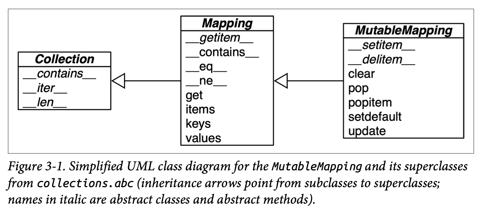

# Chapter 3 Dictionaries and Sets

* Python dicts are highly optimized—and continue to get improvements. Hash tables are the engines behind Python’s high-performance dicts.

## Modern dict Syntax

### dict Comprehensions

* Run this example:

```
python dict_comp.py
```

* A `dictcomp` (dict comprehension) builds a dict instance by taking `key:value` pairs from any iterable.

```python
>>> dial_codes = [
...     (880, 'Bangladesh'),
...     (55, 'Brazil'),
...     (86, 'China'),
...     (91, 'India'),
...     (62, 'Indonesia'),
...     (81, 'Japan'),
...     (234, 'Nigeria'),
...     (92, 'Pakistan'),
...     (7, 'Russia'),
...     (1, 'United States'),
... ]
>>> country_dial = {country: code for code, country in dial_codes}
>>> {code: country.upper()
...     for country, code in sorted(country_dial.items())
...     if code < 70}

```

### Unpacking Mappings

* Run this example:

```shell
python unpacking_mappings.py
```

* First, we can apply `**` to more than one argument in a function call.
    * This works when keys are all strings and unique across all arguments (because duplicate keyword arguments are forbidden):

```python
>>> def dump(**kwargs):
...     return kwargs
...
>>> dump(**{'x': 1}, y=2, **{'z': 3})
{'x': 1, 'y': 2, 'z': 3}
```

* Second, `**` can be used inside a dict literal—also multiple times and duplicate keys are allowed. Later occurrences overwrite previous ones.

```python
>>> {'a': 0, **{'x': 1}, 'y': 2, **{'z': 3, 'x': 4}}
{'a': 0, 'x': 4, 'y': 2, 'z': 3}
```

### Merging Mappings with `|`

```
python merging_mappings.py
```

* Python 3.9 supports using `|` and `|=` to merge mappings.

```python
'''
>>> d1 = {'a': 1, 'b': 3}
>>> d2 = {'a': 2, 'b': 4, 'c': 6}
>>> d1|d2
{'a': 2, 'b': 4, 'c': 6}
>>> d1
{'a': 1, 'b': 3}
>>> d1|=d2
>>> d1
{'a': 2, 'b': 4, 'c': 6}
'''
```

## Pattern Matching with Mappings

* Run this example:
```
python creator.py
```

```python
def get_creators(record: dict) -> list:
    match record:
        case {'type': 'book', 'api': 2, 'authors': [*names]}: # 1
            return names
        case {'type': 'book', 'api': 1, 'author': name}:
            return name
        case {'type': 'book'}:
            raise ValueError(f"Invalid 'book' record: {record!r}")
        case {'type': 'movie', 'director': name}:
            return [name]
        case _:
            raise ValueError(f'Invalid record: {record!r}')
```

* 1 Match any mapping with `'type': 'book'`, `'api': 2`, and an `'authors'` key mapped to a sequence. Return the items in the sequence, as a `new` list.
* The above shows some useful practices for handling semi-structured data such as JSON records:
    * Include a field describing the kind of record (e.g., `'type': 'movie'`)
    * Include a field identifying the schema version (e.g., `'api': 2'`) to allow for future evolution of public APIs.
    * Have case clauses to handle invalid records of a specific type (e.g., `'book'`), as well as a catch-all

* Here are the testing:

```python
'''
>>> b1 = dict(api=1, author='Douglas Hofstadter',
... type='book', title='Gödel, Escher, Bach')
>>> get_creators(b1)
'Douglas Hofstadter'
>>> from collections import OrderedDict
>>> b2 = OrderedDict(api=2, type='book',
...         title='Python in a Nutshell',
...         authors='Martelli Ravenscroft Holden'.split())
>>> get_creators(b2)
['Martelli', 'Ravenscroft', 'Holden']
>>> get_creators({'type': 'book', 'pages': 770}) # doctest: +IGNORE_EXCEPTION_DETAIL
Traceback (most recent call last):
ValueError: Invalid 'book' record: {'type': 'book', 'pages': 770}
>>> get_creators('Spam, spam, spam')
Traceback (most recent call last):
ValueError: Invalid record: 'Spam, spam, spam'
'''
```

* Note that the order of the keys in the patterns is irrelevant, even if the subject is an `OrderedDict` as `b2`.
* If we want to capture the extra key value pairs, we can use `**extra`. It must be the last in the pattern and `**_` is forbidden.

```python
>>> food = dict(category='ice cream', flavor='vanilla', cost=199)
>>> match food:
...     case {'category': 'ice cream', **details}:
...         print(f'Ice cream details: {details}')
Ice cream details: {'flavor': 'vanilla', 'cost': 199}
```

## Standard API of Mapping Types

* The `collections.abc` module provides the Mapping and MutableMapping ABCs describing the interfaces of `dict` and similar types.



* See the following example:

```python
# python mapping-api.py
>>> my_dict = {}
>>> isinstance(my_dict, abc.Mapping)
True
>>> isinstance(my_dict, abc.MutableMapping)
True
```

* To implement a custom mapping, it’s easier to extend `collections.UserDict`, or to wrap a `dict` by composition, instead of subclassing these ABCs.
* The `collections.UserDict` class and all concrete mapping classes in the standard library encapsulate the basic `dict` in their implementation, which in turn is built on a hash table.

### What Is Hashable

* An object is hashable if it has a hash code which never changes during its lifetime (it needs a `__hash__()` method), and can be compared to other objects (it needs an `__eq__()` method). Hashable objects which compare equal must have the same hash code.
    * Numeric types
    * Flat immutable types `str` and `bytes`
    * Container types are hashable if they are immutable and all contained objects are also hashable.
    * A `frozenset` is always hashable, because every element it contains must be hashable.
* See `ch03/hash-test.py`

```python
>>> tt = (1, 2, (30, 40))
>>> hash(tt)
-3907003130834322577
>>> tl = (1, 2, [30, 40])
>>> hash(tl) # doctest: +IGNORE_EXCEPTION_DETAIL
Traceback (most recent call last):
TypeError: unhashable type: 'list'
>>> tf = (1, 2, frozenset([30, 40]))
>>> hash(tf)
5149391500123939311
```

* The hash code of an object may be different depending on:
    * version of Python
    * the machine architecture
    * a salt added to the hash computation for security reasons
* The hash code of a correctly implemented object is guaranteed to be constant only within one Python process.

* User-defined types are hashable by default because their hash code is their `id()`, and the `__eq__()` method inherited from the object class simply compares the object IDs.
* An object is hashable only if its `__hash__()` always returns the same hash code. This requires that `__eq__()` and `__hash__()` only take into account instance attributes that never change during the life of the object.

### Overview of Common Mapping Methods

* See table 3-1 for Methods of the mapping types `dict`, `collections.defaultdict`, and `collections.OrderedDict`.

### Inserting or Updating Mutable Values

* I copied the `index0.py` from github code base [here](https://github.com/fluentpython/example-code-2e/blob/master/03-dict-set/index0.py)

* Run like this:

```bash
python index0.py zen.txt
```